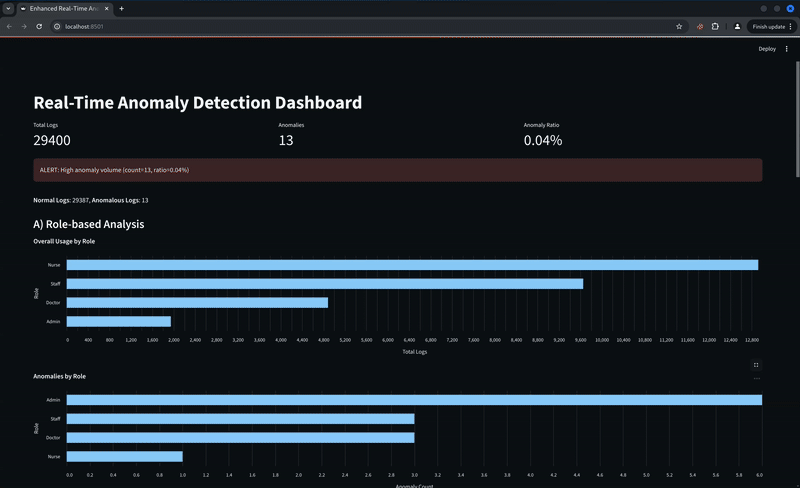

# InsightMed: AI-Driven Anomaly Detection for Insider Threats in Healthcare

A lightweight pipeline for generating synthetic access logs, preprocessing & feature-engineering them, and applying a Random Forest anomaly detector—complete with a real-time Streamlit dashboard.

---

## Methodology  
This project uses a **desk-based research** approach, synthesizing peer-reviewed studies, industry frameworks (MITRE ATT&CK, CERT Insider Threat), and case analyses under PRISMA guidelines to inform our ML design and scenarios.  

---
## Full Report
https://github.com/AvishekDhakal/courseworks/blob/main/220064_Avishek_Dhakal_Anamoly_Detection_1739520765066.pdf
---

## Quick Start

1. **Clone & install**  
   ```bash
   git clone https://github.com/your-username/InsightMed.git
   cd InsightMed
   python3 -m venv venv && source venv/bin/activate
   pip install -r requirements.txt

2. **synthetic log generation**  
   ```bash
    python3 main.py --total_logs 1000 --anomaly_ratio 0.02

3. **Run pipeline**  
   ```bash
   python3 auto_inference.py
   
4. **Lauch Dashboard**  
   ```bash
    streamlit run dashboard.py

---

## Key Findings
1. Anomaly-based ML outperformed rule-based RBAC, catching subtle insider misuses (after-hours access, excessive DELETEs) that static rules miss.

2. High accuracy & low false positives achieved via tailored feature-engineering (rolling-window request rates, role-risk encoding).

3. Scalable & real-time: runs end-to-end in under a minute per batch, with a live dashboard for security analysts.

--- 

## Limitations

Synthetic Data Bias: current evaluation uses simulated logs; real-world patterns may differ.

Scenario Scope: focuses on HTTP-based insider activities; doesn’t yet cover database or network anomalies.

Model Update: lacks an online learning mechanism for continuous adaptation.

Resource Constraints: performance on edge or low-resource environments needs further testing.

## Future Enhancements

Integrate real hospital logs to validate model robustness.

Extend to network-level and database query anomaly detection.

Implement federated learning for cross-institution collaboration without sharing raw data.

Add analyst feedback loops to refine model and reduce false positives.

## Live Dashboard




<sub>Snapshot of the real-time anomaly monitor</sub>

